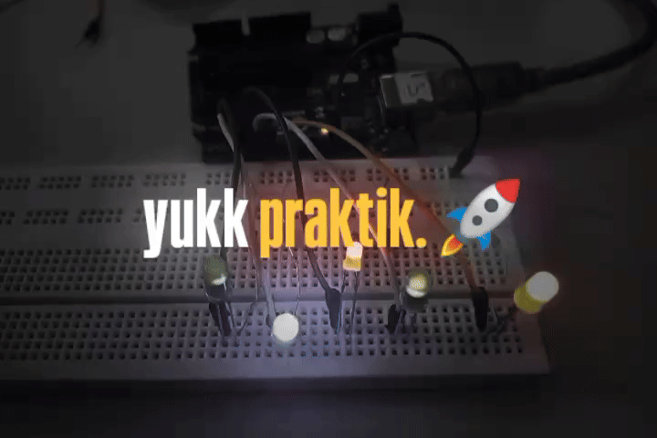

# Simulasi Lampu Lalu Lintas Menggunakan Arduino 🚦

<center>

</center>

Repository ini berisi proyek Arduino untuk mensimulasikan sistem lampu lalu lintas menggunakan Arduino Uno, LED, dan breadboard. Proyek ini dirancang untuk membantu Anda memahami dasar-dasar pemrograman Arduino dan elektronika. 🛠️

## Daftar Isi 📑
- [Bahan yang Dibutuhkan](#bahan-yang-dibutuhkan-)
- [Alat yang Dibutuhkan](#alat-yang-dibutuhkan-)
- [Instruksi Perakitan](#instruksi-perakitan-)
- [Cara Mengikuti Program Ini](#cara-mengikuti-program-ini-)

---

## Bahan yang Dibutuhkan 🛒
- **Arduino Uno**: Papan mikrokontroler yang digunakan untuk proyek ini. 🕹️
- **Breadboard**: Untuk merakit rangkaian tanpa perlu menyolder. 🧩
- **Kabel Jumper**: Untuk menghubungkan komponen di breadboard. 🔌
- **LED**: LED merah, kuning, dan hijau untuk mensimulasikan lampu lalu lintas. 🚨
- **Resistor**: Resistor 220Ω untuk melindungi LED. ⚡
- **Kabel USB**: Untuk menghubungkan Arduino ke laptop. 💻

---

## Alat yang Dibutuhkan 🛠️
- **Laptop/PC**: Dengan Arduino IDE terinstal. 🖥️
- **Arduino IDE**: Software untuk menulis dan mengunggah kode ke Arduino. 📂

---

## Instruksi Perakitan 🔧
1. **Pasang LED di Breadboard**: Masukkan LED merah, kuning, dan hijau ke dalam breadboard. 🚦
2. **Hubungkan Resistor**: Sambungkan resistor 220Ω ke kaki positif (anoda) setiap LED. 🔗
3. **Hubungkan Kabel Jumper**:
   - Sambungkan ujung lain resistor ke pin digital Arduino (misalnya, pin 10, 9, dan 8 untuk LED merah, kuning, dan hijau). 📍
   - Sambungkan kaki negatif (katoda) setiap LED ke ground (GND) Arduino. ⚡
4. **Hubungkan Arduino ke Laptop**: Gunakan kabel USB untuk menghubungkan Arduino ke laptop. 🔌

---

## Cara Mengikuti Program Ini 🚀
1. **Clone Repository Ini**:
   - Buka terminal atau command prompt.
   - Jalankan perintah berikut untuk meng-clone repository ini ke komputer Anda:
     ```bash
     git clone https://github.com/rakhaafd/praktik-arduino.git
     ```

2. **Buka File `.ino` di Arduino IDE**:
   - Buka folder hasil clone repository.
   - Cari file dengan ekstensi `.ino` (misalnya, `1.1-program-lalu-lintas.ino`).
   - Buka file tersebut di Arduino IDE. 📂

3. **Unggah Kode ke Arduino**:
   - Hubungkan Arduino ke laptop menggunakan kabel USB. 🔌
   - Pilih `Tools` > `Board` > `Arduino Uno`. 🖥️
   - Pilih `Tools` > `Port` dan pilih port tempat Arduino terhubung. 📍
   - Klik tombol `Upload` (ikon panah kanan) untuk mengunggah kode ke Arduino. ⬆️

4. **Amati Simulasi**:
   - Setelah kode berhasil diunggah, LED akan menyala secara berurutan, mensimulasikan sistem lampu lalu lintas. 🚦

---

### Selamat mencoba dan semoga proyek ini bermanfaat! 🚀✨